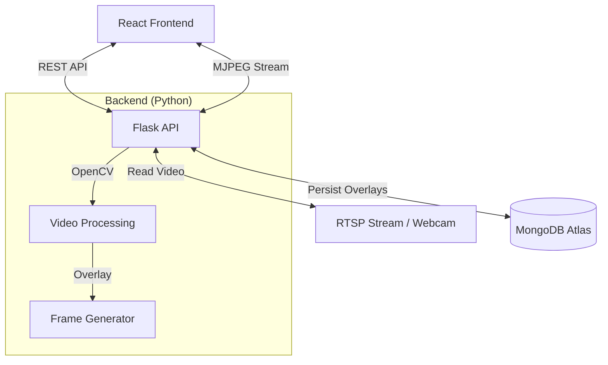

# RTSP Livestream Overlay Web Application

   

## 📖 Project Overview

This is a Full-Stack Web Application designed to manage and display real-time interactive overlays on an RTSP or webcam video stream. Built for flexibility and ease of use, it allows users to dynamically add, move, resize, and delete text and image overlays that persist in a database.

This project demonstrates the integration of complex video processing pipelines with modern web technologies, solving the challenge of low-latency video manipulation in a browser environment.

**Live Demo**: [https://rtsp-livestream-overlay-web-applica.vercel.app/](https://rtsp-livestream-overlay-web-applica.vercel.app/)

**Video Walkthrough**: [Watch Demo Video](https://drive.google.com/file/d/1ZJZ25elJOqiZkxxSMZsw7wuvtiO3mlwD/view?usp=sharing)

---

## 🏗 System Architecture

The application follows a decoupled client-server architecture:



---

## ✨ Key Features

*   **Real-Time Streaming**: Low-latency video streaming using MJPEG protocol (Multipart/x-mixed-replace).
*   **Dynamic Overlays**:
    *   **Text Overlays**: Customizable text content with font styling.
    *   **Image Overlays**: Upload and position images (logos, watermarks).
*   **Interactive UI**: Drag-and-drop positioning and resizable elements using `react-draggable` and `react-resizable`.
*   **Persistence**: All overlay configurations are saved to MongoDB, ensuring state is maintained across sessions.
*   **Secure Authentication**: JWT-based user login and registration with BCrypt password hashing.
*   **Responsive Design**: Modern, glassmorphism-inspired interface optimized for various screen sizes.

---

## � Directory Structure

```
rtsp-livestream-overlay/
├── backend/
│   ├── app.py # Main Flask Application & Logic
│   └── requirements.txt # Python Dependencies
├── frontend/
│   ├── src/
│   │   ├── components/ # Reusable UI Components
│   │   ├── services/ # API Integration Services
│   │   └── App.jsx # Main React Application
│   └── vite.config.js # Build Configuration
└── README.md # Project Documentation
```

---

## 🚀 Getting Started

Follow these instructions to set up and run the project locally.

### Prerequisites

*   **Python 3.8+**
*   **Node.js 18+**
*   **MongoDB Connection String** (MongoDB Atlas recommended)

### 1. Clone the Repository

```bash
git clone https://github.com/your-username/rtsp-livestream-overlay.git
cd rtsp-livestream-overlay
```

### 2. Backend Setup

1.  Navigate to the backend directory:
    ```bash
    cd backend
    ```
2.  Create and activate a virtual environment:
    ```bash
    python -m venv venv
    source venv/bin/activate  # Windows: venv\Scripts\activate
    ```
3.  Install dependencies:
    ```bash
    pip install -r requirements.txt
    ```
4.  Configure Environment Variables:
    Create a `.env` file in the `backend` folder:
    ```env
    MONGO_URI=mongodb+srv://<username>:<password>@cluster.mongodb.net/dbname
    JWT_SECRET=your_secure_secret
    VIDEO_SOURCE=0
    ```
    *   Set `VIDEO_SOURCE=0` for Webcam.
    *   Set `VIDEO_SOURCE=/absolute/path/to/video.mp4` for a local file test.
    *   Set `VIDEO_SOURCE=rtsp://...` for an IP Camera.

5.  Run the server:
    ```bash
    python app.py
    ```
    *The backend runs on `http://localhost:5001`*

### 3. Frontend Setup

1.  Navigate to the frontend directory:
    ```bash
    cd ../frontend
    ```
2.  Install dependencies:
    ```bash
    npm install
    ```
3.  Run the development server:
    ```bash
    npm run dev
    ```
    *The frontend runs on `http://localhost:5173`*

---

## 🎥 User Guide

### 1. Authentication
*   Register a new account or log in with existing credentials.

### 2. Setting the Video Source
*   By default, the app may try to load your webcam.
*   To change the source dynamically via the UI (for testing):
    1.  Look for the **RTSP URL** input field on the dashboard.
    2.  Enter an **Absolute File Path** (e.g., `/Users/name/Videos/sample.mp4`) or a valid **RTSP URL**.
    3.  Click **Start Stream**.

### 3. Managing Overlays
*   **Add**: Click "Add Overlay" in the control panel. Select "Text" or "Image".
*   **Move**: Click and drag any overlay on the video to reposition it.
*   **Resize**: Drag the bottom-right corner of an overlay to resize it.
*   **Edit/Delete**: Use the Control Panel list to update content or remove overlays.

---

## 📡 API Documentation

The backend exposes a RESTful API.

### Base URL
`http://localhost:5001/api`

### Endpoints

#### Custom Overlay Management

| Method | Endpoint | Description | Payload Example |
| :--- | :--- | :--- | :--- |
| **GET** | `/overlays` | Get all overlays | N/A |
| **POST** | `/overlays` | Create an overlay | `{"type": "text", "content": "Hello", "x": 10, "y": 10, "width": 100, "height": 50}` |
| **PUT** | `/overlays/<id>` | Update an overlay | `{"x": 50, "y": 50}` |
| **DELETE** | `/overlays/<id>` | Delete an overlay | N/A |

#### Stream Control

| Method | Endpoint | Description | Payload Example |
| :--- | :--- | :--- | :--- |
| **POST** | `/stream/source` | Set video source | `{"source": "/path/to/file.mp4"}` |
| **POST** | `/stream/stop` | Stop the stream | N/A |

---

## 💡 Challenges & Solutions

*   **Challenge**: Maintaining high video framerate while processing overlays in Python.
    *   **Solution**: Utilized OpenCV's efficient backend processing and MJPEG streaming to minimize latency.
*   **Challenge**: Synchronizing overlay state between the drag-and-drop frontend and the backend.
    *   **Solution**: Implemented a robust React state management system that synchronizes coordinates with the MongoDB database on drag-stop events.

---

## 🤝 Contribution

Contributions are welcome! Please fork the repository and submit a pull request.

---

## 📄 License

This project is licensed under the MIT License.
